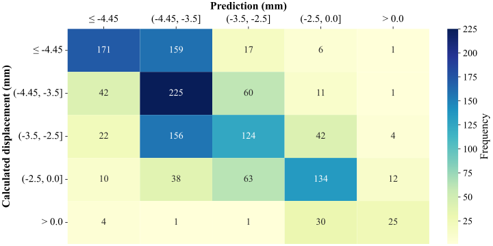
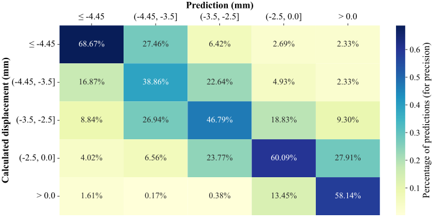

Track Fixity Layer
==================

Authors: [**Qian Fu**](https://research.birmingham.ac.uk/en/persons/qian-fu), [**John M. Easton**](https://research.birmingham.ac.uk/en/persons/john-easton) and [**Michael P. N. Burrow**](https://research.birmingham.ac.uk/en/persons/michael-burrow)<br>
Project support: **Sarah Jordan**


## Introduction

This project aims to develop a data mining tool to assist engineers in analysing and predicting track movements over time. The analysis is based on recorded asset data, local operational and environmental factors and knowledge of track design in the area. In this prototype phase, the team focused on assembling a structured dataset for a representative track section to develop data-driven models of track movement, identify key track geometry parameters predicting future movements and generate fixity values for all reference curves used on the GB rail network.


## Key achievements

The project has resulted in the following key achievements:
- **Data integration and management**: A data cleaning and pre-processing workflow has been developed using the open-source PostgreSQL database. This workflow enables smooth integration and management of the data corpus. Initially, six industry data streams were used (CARRS, CNM, OPAS, ballast type, track quality, and point cloud surveys). The workflow is easily extensible, allowing for the inclusion of additional data sets in the future, provided they are referenced linearly (e.g., ELR + track mileage) or using standard geographic coordinate systems.
- **Predictive machine learning model**: A machine learning model was trained on data from an 80-km section of the East Coast Main Line south of Edinburgh. This model predicts future track movements, with most predictions falling within the correct bin or within a single bin width of the true value. The model primarily used parameters such as curvature, cant, and maximum speed for its predictions.
- **Python package development**: A three-module Python package has been developed to facilitate the rapid implementation of the described functionalities in software workflows.

These achievements lay the groundwork for further development and refinement in future phases of the project.


## Technical Report

- [Fu, Q.](https://research.birmingham.ac.uk/en/persons/qian-fu), [Easton, J. M.](https://research.birmingham.ac.uk/en/persons/john-easton) and [Burrow, M. P. N.](https://research.birmingham.ac.uk/en/persons/michael-burrow) (2021). Track Fixity Layer - Final Report. Approved by Network Rail Ltd. \[[Appendix - Technical Documentation](docs/build/latex/track_fixity_layer.pdf)]


## Conference/Workshop Posters

- Clark Lecture 2024, University of Birmingham, Birmingham, 26 June 2024. \[[Poster](docs/posters/3_Clark_Lecture_2024_Poster_Fu_et_al.pdf)]
- Research Software Engineering in Data & AI Workshop, 15-17 February 2023, University of Warwick, Coventry. \[[Poster](docs/posters/2_RSE_Data_AI_Workshop_2023_Fu_et_al.pdf)]
- Transportation Research Board 102nd Annual Meeting, Washington, D.C., USA, 8–12 January 2023. \[[Poster](docs/posters/1_TRBAM_2023_03682_Fu_et_al.pdf)]


## Publication

- [Fu, Q.](https://research.birmingham.ac.uk/en/persons/qian-fu), [Easton, J. M.](https://research.birmingham.ac.uk/en/persons/john-easton) and [Burrow, M. P. N.](https://research.birmingham.ac.uk/en/persons/michael-burrow) (2024). Development of an Integrated Computing Platform for Measuring, Predicting, and Analyzing the Profile-Specific Fixity of Railway Tracks. Transportation Research Record, 2678(6), 1-13. [doi:10.1177/03611981231191521](https://doi.org/10.1177/03611981231191521).


## Demo

> **Note:** The following notebook code is for demonstration purposes only. Access to the project's database server will be necessary to successfully instantiate the prototype model. 

```python
>>> from src.modeller.prototype import TrackMovementEstimator

>>> # Specify element, direction and subsection length over which average movement is calculated
>>> element = 'Left Top'
>>> direction = 'Up'
>>> subsect_len = 10

>>> tme = TrackMovementEstimator(element=element, direction=direction, subsect_len=subsect_len)
```
    Initialising the feature collator ... Done.
    Initialising the estimator ... Done.


### 1. Create training and test data sets.

```python
>>> tme.get_training_test_sets(test_size=0.2, random_state=1)
```
    Calculating track movement ... Done.
    Collating features: 
      ballasts (src. Ballast summary) ... Done.
      structures (src. CARRS and OPAS) ... Done.
    Finalising the data integration ... Done.
    Splitting into training and test sets ... Done.
    The data is now ready for modelling.
    
```python
>>> tme.X_train
```
          Curvature    Cant  Max speed  ...  Retaining walls  Tunnels  Stations
    3306   0.000000    0.00       90.0  ...                0        0         0
    1910  -0.000858 -110.00       95.0  ...                0        0         0
    1192  -0.000545  -89.01       80.0  ...                0        0         0
    981   -0.000767 -130.00       95.0  ...                0        0         0
    5139  -0.000256  -63.00      110.0  ...                0        0         0
    ...         ...     ...        ...  ...              ...      ...       ...
    1016   0.000000    0.00       95.0  ...                0        0         0
    5907  -0.000504 -127.00      110.0  ...                0        0         0
    4597  -0.001060 -125.00       85.0  ...                0        0         0
    243   -0.000185  -21.42       95.0  ...                0        0         0
    5869  -0.000394 -108.78      110.0  ...                0        0         0
    
    [5433 rows x 9 columns]

```python
>>> tme.y_train
```
    2736    1
    1578    3
    1060    0
    870     2
    4512    3
           ..
    905     2
    5192    2
    3980    2
    235     1
    5157    3
    Name: lateral_displacement_mean, Length: 5433, dtype: int64

```python
>>> tme.X_test
```
          Curvature    Cant  Max speed  ...  Retaining walls  Tunnels  Stations
    5628   0.000731  103.38      100.0  ...                0        0         0
    5696   0.000955  135.00      100.0  ...                0        0         0
    5431   0.000960  142.00      100.0  ...                0        0         0
    3471  -0.000784 -108.50       90.0  ...                0        0         0
    2908  -0.001264 -155.00       85.0  ...                0        0         0
    ...         ...     ...        ...  ...              ...      ...       ...
    247   -0.000337  -39.00       95.0  ...                0        0         0
    3904   0.000000    0.00      125.0  ...                0        0         0
    1054   0.000000    0.00       95.0  ...                0        0         0
    3191  -0.000858 -156.00       90.0  ...                0        0         0
    4026  -0.000271  -92.71      125.0  ...                0        0         0
    
    [1359 rows x 9 columns]

```python
>>> tme.y_test
```
    4958    3
    4999    0
    4793    1
    2901    2
    2394    2
           ..
    239     2
    3309    2
    943     0
    2621    3
    3431    3
    Name: lateral_displacement_mean, Length: 1359, dtype: int64

### 2. Train an RF model

```python
>>> tme.classifier(n_estimators=300, max_depth=15, oob_score=True, n_jobs=8)
```
    Model training in process ... 
    [Parallel(n_jobs=8)]: Using backend ThreadingBackend with 8 concurrent workers.
    [Parallel(n_jobs=8)]: Done  34 tasks      | elapsed:    0.0s
    [Parallel(n_jobs=8)]: Done 184 tasks      | elapsed:    0.1s
    [Parallel(n_jobs=8)]: Done 300 out of 300 | elapsed:    0.3s finished
    Done.
    
    Testing accuracy ... 
    [Parallel(n_jobs=8)]: Using backend ThreadingBackend with 8 concurrent workers.
    [Parallel(n_jobs=8)]: Done  34 tasks      | elapsed:    0.0s
    [Parallel(n_jobs=8)]: Done 184 tasks      | elapsed:    0.0s
    [Parallel(n_jobs=8)]: Done 300 out of 300 | elapsed:    0.0s finished
    Done.
    
    Mean accuracy: 49.96%

                        Importance
    Curvature            0.388747
    Cant                 0.372477
    Max speed            0.201602
    Underline bridges    0.009513
    Overline bridges     0.007261
    Max axle load        0.006700
    Retaining walls      0.006048
    Tunnels              0.005787
    Stations             0.001866

### 3. Create a confusion matrix

#### 3.1 View the confusion matrix for the trained RF model

```python
>>> tme.view_confusion_matrix()
```
    [Parallel(n_jobs=8)]: Using backend ThreadingBackend with 8 concurrent workers.
    [Parallel(n_jobs=8)]: Done  34 tasks      | elapsed:    0.0s
    [Parallel(n_jobs=8)]: Done 184 tasks      | elapsed:    0.0s
    [Parallel(n_jobs=8)]: Done 300 out of 300 | elapsed:    0.0s finished

<figure>
  
</figure>

#### 3.2 Normalise the confusion matrix over the predicted labels

```python
>>> tme.view_confusion_matrix(normalise='pred')
```
    [Parallel(n_jobs=8)]: Using backend ThreadingBackend with 8 concurrent workers.
    [Parallel(n_jobs=8)]: Done  34 tasks      | elapsed:    0.0s
    [Parallel(n_jobs=8)]: Done 184 tasks      | elapsed:    0.0s
    [Parallel(n_jobs=8)]: Done 300 out of 300 | elapsed:    0.0s finished
    
<figure>
  
</figure>
